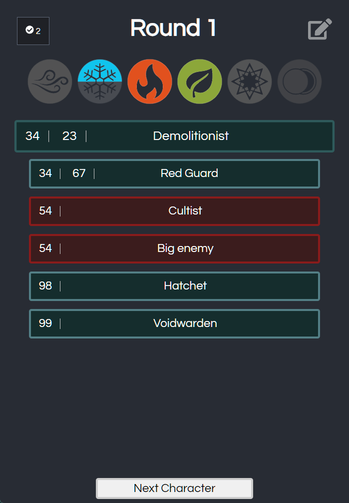
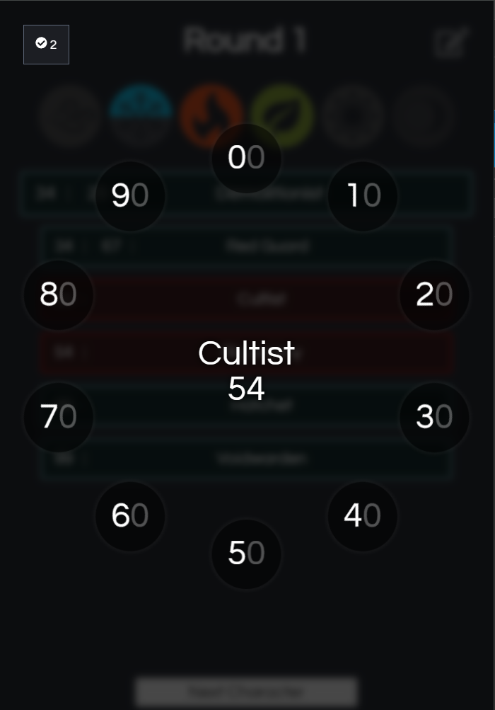
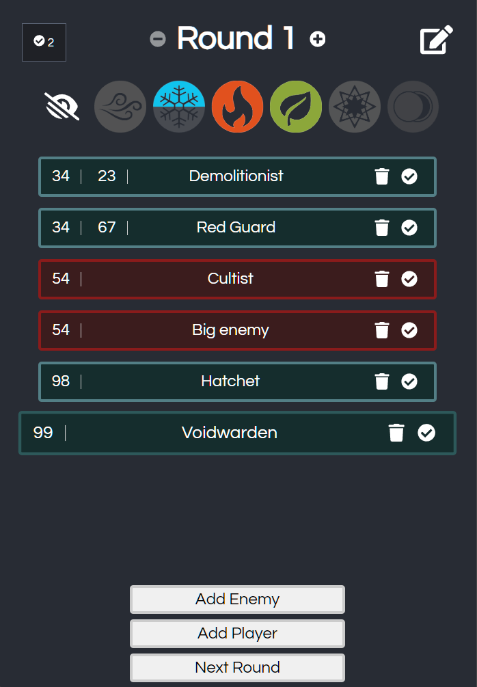
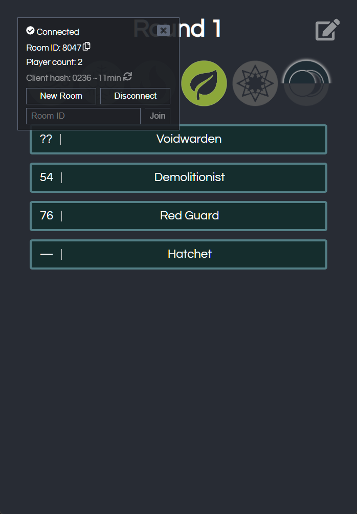

# Gloomhaven Initiative Tracker

http://turns.amadare.top

Application to track initiative for Gloomhaven board game. 
Pretty light on advanced user-features and minimalistic design to keep players playing board game instead of fiddling with phone too much.

## Features

- **network connected**: can be used by multiple users at the same time from different devices
- **initiative visibility**: until everyone initiative is set, it isn't displayed so you can set your initiative asynchronously
- **elements tracking**: simplifies elements tracking. Auto update it on round change (can be hidden if not needed)
- **mobile friendly**: while perfectly usable on large screens, it is designed to be very convenient for mobile screens
- **offline capable**: once loaded, it can be used offline (except for network features)
- **підтримка української**: Темна Гавань, а не Gloomhaven! (Ukrainian language support)

## Screenshots

